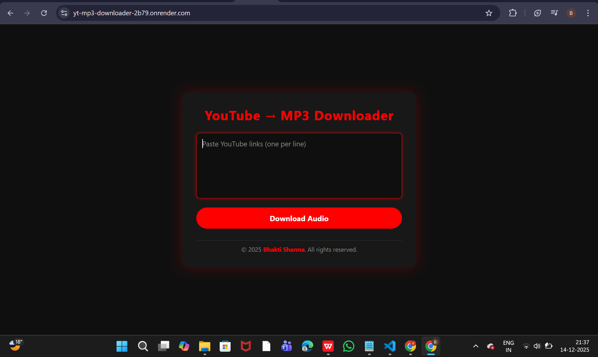
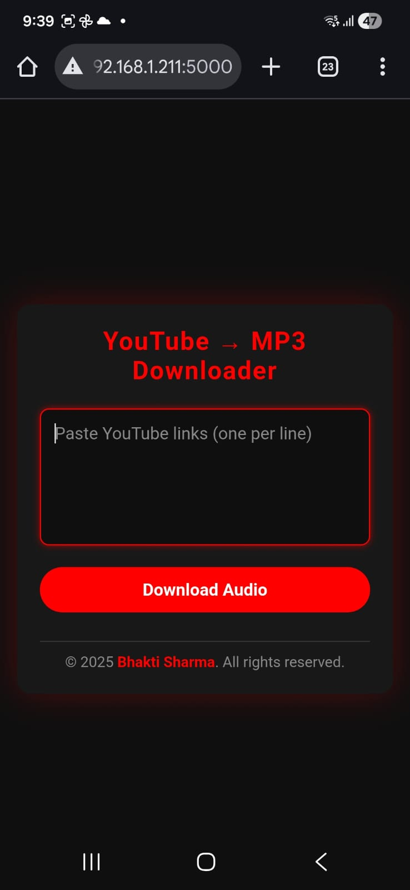

# YouTube to MP3 Downloader 🎧

A Flask-based web application that converts YouTube videos into MP3 audio files using yt-dlp.

## Features
- Convert YouTube videos to MP3
- Supports multiple YouTube links
- Responsive UI (mobile & desktop)
- Clean and simple interface

## Tech Stack
- Python
- Flask
- yt-dlp
- HTML, CSS
- Git & GitHub

## Live Demo
Deployed on Render (free tier): https://yt-mp3-downloader-2b79.onrender.com/

Due to YouTube rate-limiting on shared cloud IPs, downloads may fail on the live demo.
The application works correctly in a local environment.


## 📸 Screenshots

### Desktop View


### Mobile View


## Run Locally
```bash
git clone https://github.com/your-username/your-repo.git
cd your-repo
pip install -r requirements.txt
python app.py

